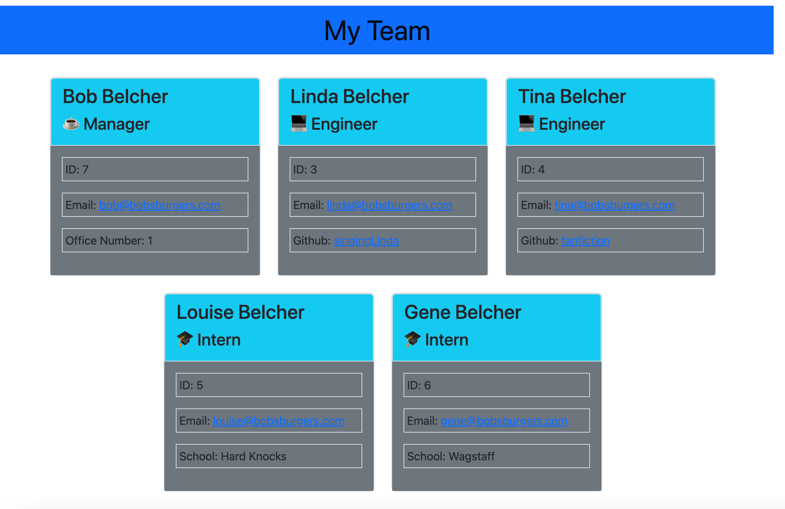

# Team Profile Generator

   

- [Team Profile Generator](#team-profile-generator)
  - [User Story](#user-story)
  - [Description](#description)
  - [Installation](#installation)
  - [License](#license)
  - [GitHub Repo](#github-repo)
  - [Link to video for project](#link-to-video-for-project)
  - [Questions](#questions)

## User Story
    AS A manager
    I WANT to generate a webpage that displays my team's basic info
    SO THAT I have quick access to their emails and GitHub profiles

  ## Description
    GIVEN a command-line application that accepts user input
    WHEN I am prompted for my team members and their information
    THEN an HTML file is generated that displays a nicely formatted team roster based on user input
    WHEN I click on an email address in the HTML
    THEN my default email program opens and populates the TO field of the email with the address
    WHEN I click on the GitHub username
    THEN that GitHub profile opens in a new tab
    WHEN I start the application
    THEN I am prompted to enter the team manager’s name, employee ID, email address, and office number
    WHEN I enter the team manager’s name, employee ID, email address, and office number
    THEN I am presented with a menu with the option to add an engineer or an intern or to finish building my team
    WHEN I select the engineer option
    THEN I am prompted to enter the engineer’s name, ID, email, and GitHub username, and I am taken back to the menu
    WHEN I select the intern option
    THEN I am prompted to enter the intern’s name, ID, email, and school, and I am taken back to the menu
    WHEN I decide to finish building my team
    THEN I exit the application, and the HTML is generated

    
  ## Installation
    -Clone the repo
    -Install node.js: https://coding-boot-camp.github.io/full-stack/nodejs/how-to-install-nodejs
    -Then in the integrated terminal for the cloned repo terminal:
      -node index.js

  ## License
      
   

      This project is coverted under the MIT License

  ## GitHub Repo
https://github.com/jleitz27/team-profile-generator 

  ## Link to video for project
  https://www.screencast.com/t/kIeb1akYKnt

  
  

  ## Questions

  If you have any additional questions please contact me:  
      - GitHub: jleitz27  (https://github.com/jleitz27)
      - Email:  jkleitz27@gmail.com